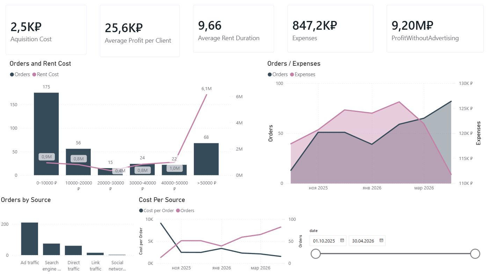
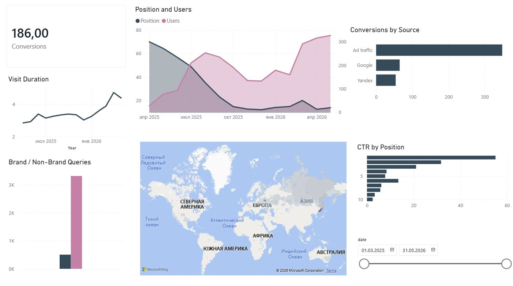
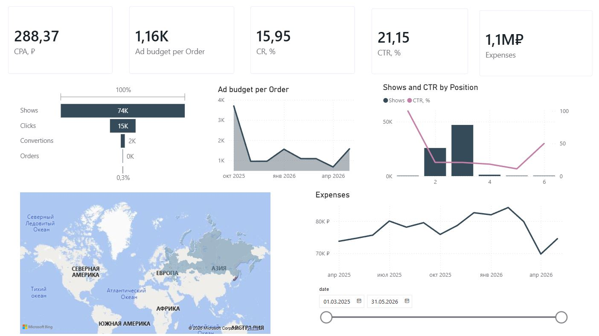

# Marketing Analytics and Attribution System for a Rental Business

## Project Overview

This project started as an attempt to answer a simple business question:

**Which marketing channels actually generate profitable orders?**

The company used several marketing and analytics platforms, but the data was scattered across different systems and there was no straightforward way to connect marketing activity with actual business results.

To solve this problem, I built a reporting system that combines CRM, web analytics, SEO, and advertising data in a centralized PostgreSQL database and Power BI environment.

The final solution made it possible to track marketing performance, estimate acquisition costs, and evaluate the contribution of different traffic sources to revenue and profitability.

---

## Data Sources

The project combines data from several sources:

* Yandex Metrica API
* Yandex Webmaster
* Google Analytics
* Google Search Console
* CRM system
* Pixel Tools
* Internal PostgreSQL tables

The collected data includes:

* Website traffic
* User behavior metrics
* Conversion events
* Search visibility
* Keyword rankings
* Advertising expenses
* Orders and rental transactions
* Business performance metrics

---

## Architecture

```text
Yandex Metrica API
Google Analytics
CRM
SEO Platforms
        │
        ▼
Python ETL Scripts
        │
        ▼
PostgreSQL
        │
        ▼
SQL Transformations
        │
        ▼
Power BI Dashboards
```

---

## Data Processing

Yandex Metrica data is collected through Python scripts using the API and loaded into PostgreSQL.

Additional datasets are imported from external sources and integrated into a centralized reporting model.

A calendar dimension table is used as the primary connection point between datasets, allowing marketing, CRM, and SEO metrics to be analyzed together.

SQL transformations were used to:

* Standardize source data
* Clean inconsistent values
* Aggregate marketing metrics
* Calculate channel-level performance indicators
* Prepare reporting datasets for Power BI

Examples of transformations included traffic source normalization, region standardization, metric aggregation, and marketing cost calculations.

---

## Key Challenges

### Missing Attribution Data

The most significant challenge was the lack of traffic source information inside the CRM system.

The CRM contained:

* Orders
* Rental periods
* Revenue information

However, it did not store acquisition channels.

Without this information, it was impossible to directly measure channel profitability or customer acquisition costs.

To address this issue, I developed a rule-based attribution approach using conversion data from Yandex Metrica.

Phone calls and website order submissions were selected as the most reliable conversion events. Their distribution across traffic sources was then used to estimate how many orders were likely generated by each channel.

This allowed me to calculate:

* Estimated orders by channel
* Cost per acquisition (CPA)
* Revenue contribution by channel
* Channel profitability

### Internal Traffic Distortion

Another challenge involved internal traffic sessions recorded by Yandex Metrica.

These sessions generated conversions but often lacked reliable source information because users returned directly to the website after long periods of inactivity.

If left uncorrected, this would distort attribution results.

To reduce this bias, internal conversions were redistributed proportionally across known traffic sources based on observed conversion shares.

### Data Integration

The project also required combining datasets with different structures, update frequencies, and levels of detail.

Building a centralized PostgreSQL model made it possible to create a consistent reporting layer across all sources.

---

## Dashboards

### Executive Dashboard

Business-focused reporting including:

* Customer Acquisition Cost (CPA)
* Average Profit per Order
* Average Rental Duration
* Marketing Expenses
* Net Profit

The dashboard provides a high-level view of business performance and marketing efficiency.



---

### SEO Dashboard

Focused on organic search performance:

* Keyword Rankings
* Search Visibility
* Organic Traffic
* Conversion Performance
* Geographic Distribution of Visitors



---

### Advertising Dashboard

Focused on paid acquisition performance:

* CPA
* CTR
* Conversion Rate
* Advertising Costs
* Marketing Funnel Performance



---

## Results

One of the most interesting outcomes of the project was being able to compare SEO and paid advertising using a common business framework.

After approximately one year of tracking and optimization, SEO-generated orders reached a point where their estimated acquisition cost became lower than that of paid advertising channels.

This helped demonstrate the long-term value of search optimization efforts and provided a clearer picture of marketing return on investment.

---

## Technologies

* PostgreSQL
* SQL
* Python
* Power BI
* REST APIs
* Yandex Metrica API
* Yandex Webmaster
* Google Analytics
* Google Search Console
* Excel

---

## Repository Structure

```text
Scripts/
├── export_metrica.py
├── export_metrica_goals.py
├── load_to_postgres_metrica_main.py
└── load_to_postgre_metrica_goals.py

Sql/
├── Date_table.sql
├── Monthly_expenses.sql
└── transformations.sql

Screenshots/
├── CRM_Analysis.jpg
├── SEO_Analysis.jpg
└── Ad_Analysis.jpg
```
